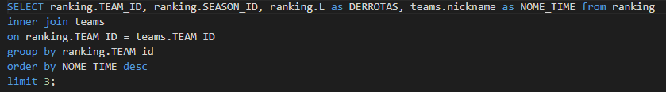

# Banco_de_Dados_M4_Resilia_NBA
Trabalho em grupo sobre banco de dados da NBA para o bootcamp da Resilia. 

(EN)

Group work about NBA databases for Resilia bootcamp. 

## Objetivo / Goals
Fazer queries no banco de dados disponibilizado e responder perguntas criadas pelo grupo.

(EN)

Do some queries in the NBA database and answer some questions that ourselves created.

## O projeto / The project

## As perguntas / The Questions

## Queries e Respostas / Queries and Answers

<h3> Pergunta 1 </h3>

<h3> Pergunta 2 </h3>

<h3> Pergunta 3 </h3>

<h3> Pergunta 4 </h3>

<h3> Pergunta 5 </h3>

<h3> Pergunta 6 </h3>

<h3> Pergunta 7 </h3>

